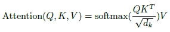

写在前面

费曼说
What I cannot create, I do not understand.

我构建这个项目的初衷是因为目前的大语言模型的快速发展，从预训练范式转向推理范式，而大多数的学习教程往往只能点到为止，没有进一步分析其中的细节，比如，如何打磨数据集，如何设计训练过程，如何理解模型架构等等，
时代的列车呼啸而过，现在的语言模型因为其算力的庞大需求令大多数个人开发者望而却步，其极大的影响了技术的下沉和发展，提供一个高质量的，近工业化的demo将有助于后来者拾阶而上，投入到更未来化的建设中去。

特别说明，这个demo是一个进阶的教程，旨在提供一个高性能的训练流程和细节的教学,致力于使用已有材料打磨出一个更为先进的模型，自顶向下的方式分析每一处细节，流程如下:

模型架构
 -注意力
 -多token预测解码
 -moe
 -全局和交错注意力
 -注意力池化
 
分词器
 -训练
 -泛化性
  
数据集处理
  -中英语料
  -推理语料
  -冷启动语料
  
优化器
  -adamw
  -Muon
  
参数选择
  -模型参数
  -训练参数
  
训练加速
  -混合精度训练
  -分布式训练
  -梯度累计
  -梯度检查点
预训练

退火

冷启动

强化学习
 -grpo
 -dapo
 -gspo
 
指令微调
 -sft
 -dpo
性能评估
 -lm-eval

模型量化
  -llama.cpp
  
推理部署
  -vllm
  -sglang
  -ollama

(2025.9.20更新)
一、模型架构
1.1注意力机制，这个工作从chatgpt3.5最初得到广泛关注，而后近乎成为目前所有主流大语言模型的主体选择架构，

如果我们品读过gpt的最初实现和最近更为先进模型的实现，我们会发现，其结构从一个简洁的架构转向了更为复杂，更具工业化色彩的架构。
其表现为，moe混合专家的引入，最初google引入这一改进的初衷是为了减少推理时的算力而又尽量保持模型的性能，这一架构在后来被mistral和deepseek发扬光大，并在当下时代成为近乎所有大模型的主体设计。
这一工作是经济性的，但是在小模型的架构上，我们该如何考量呢。
值得肯定的，由于其稀疏激活的特点，moe模型的性能虽然不能与全参数等价的密集模型相平，但是只对有效激活参数来说却略胜一筹。

